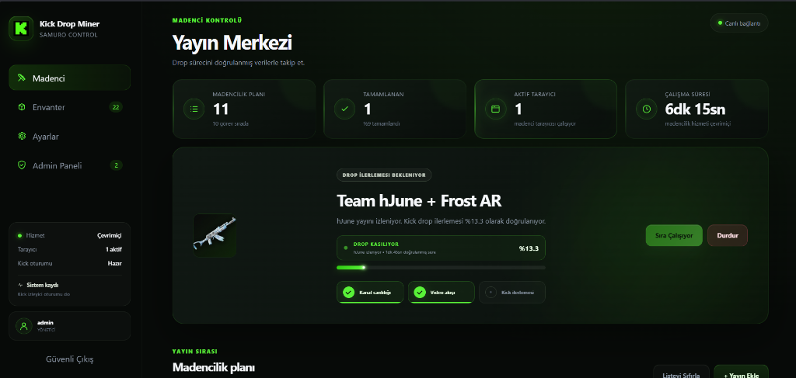

<div align="center">
  
  <br/><br/>
  
  # ⛏️ Kick Drop Miner
  
  *Kick drop kampanyalarını doğrulanmış video oynatımı ve Kick sunucu ilerlemesiyle otomatik olarak takip eden akıllı madenci.*
  
  [](https://www.python.org/)
  []()
  []()
</div>

---

## 🌟 Proje Hakkında

**Kick Drop Miner**, arka planda Kick yayınlarını izleyerek droplarınızı otomatik olarak toplayan gelişmiş bir otomasyon aracıdır. Gelişmiş doğrulama sistemleri sayesinde sadece yayın açıkken ilerleme kaydeder ve gereksiz sistem kaynağı tüketimini önler.

Proje iki farklı arayüz seçeneği sunar:
- 🌐 `webapp.py`: **Ubuntu/Pterodactyl** için modern web paneli (7/24 Sunucu çalışması için ideal)
- 🖥️ `main.py`: **Windows** için eski masaüstü arayüzü

---

## 🚀 Öne Çıkan Özellikler

### 🛡️ Gelişmiş Madenci Motoru (Sunucu Sürümü)
- **Sıfır Kaynak Tüketimi**: Boştayken açık tarayıcı sayısı `0`dır. Yalnızca madencilik sırasında `1` Firefox (veya Chrome) açılır.
- **Akıllı Doğrulama**: Video süresi yalnız kanal canlıysa ve `currentTime` (video süresi) gerçekten ilerliyorsa artar.
- **WebSocket Kontrolü**: Kick izleyici tokenı, WebSocket bağlantısı ve kanal handshake mesajları sıkı bir şekilde doğrulanır.
- **API Senkronizasyonu**: Drop ilerlemesi her 60 saniyede Kick sunucusundan okunur.
- **Otomatik Geçiş**: İlerleme 8 dakika boyunca değişmezse kanal kapatılır ve sıradaki uygun kanala anında geçilir.
- **Tamamlanma Kontrolü**: Kampanya yalnız Kick `%100/claimed` yanıtı döndürdüğünde tamamlandı sayılır.
- **Güvenli Kapanış**: Durdurma, sıra temizleme ve uygulama kapanışı, tüm açık tarayıcı süreçlerini arkada iz bırakmadan temizler.

### 💻 Modern Web Arayüzü
- **Animasyonlu Yönetim Paneli**: Türkçe, kullanımı kolay ve modern tasarım.
- **Çoklu Kullanıcı Desteği**: Kullanıcı adı/şifre ile oturum açma, her kullanıcı için tamamen ayrı çerez, sıra ve worker yönetimi.
- **Admin Paneli**: Yöneticiye özel kullanıcı istatistikleri, son erişim, IP ve Kick madenci durum takip ekranı.
- **Görsel Zenginlik**: Kampanya bannerları, ödül görselleri ve kanal avatarları ile desteklenmiş arayüz.
- **Oyun Bazlı Envanter**: Drop envanteriniz oyun bazında (Örn: Rust, CS2) otomatik gruplanır.
- **Akıllı Kampanya Gruplama**: Aynı drop için uygun tüm yayıncılar tek bir görev çatısı altında toplanır.
- **Canlı Konsol**: Renk kodlu, anlık izlenebilen ve indirilebilen madenci hata ayıklama konsolu.
- **Yüksek Güvenlik**: CSRF koruması, imzalı oturumlar, scrypt parola doğrulaması ve brute-force korumalı giriş hız sınırı.

---

## ⚙️ Pterodactyl Sunucu Gereksinimleri

Web panelini Pterodactyl üzerinde çalıştırmak için:
- **İşletim Sistemi**: Ubuntu ARM64 veya AMD64
- **Python**: 3.11 veya üzeri
- **Tarayıcı**: Firefox ESR (veya uyumlu Chromium)
- **Gereksinimler**: Xvfb, FFmpeg, Firefox medya kitaplıkları ve Geckodriver

*(Bu depo için hazırlanan `Dockerfile.arm64` ve `pterodactyl-start.sh` dosyaları, ARM64 Pterodactyl kurulumunu tam destekler.)*

---

## 🔧 Kurulum ve Çalıştırma

### 1. Ortam Ayarları (.env)
`.env.example` dosyasını kopyalayarak `.env` adında yeni bir dosya oluşturun ve içindeki değerleri düzenleyin:

```env
KDM_PASSWORD_HASH=scrypt$...
KDM_SESSION_SECRET=uzun-rastgele-bir-deger
KDM_SECURE_COOKIES=1
KDM_ADMIN_USERNAME=admin
KDM_REGISTRATION_ENABLED=1
KDM_MAX_ACTIVE_MINERS=3
KDM_DATA_DIR=/home/container/data
KDM_STREAM_BROWSER=firefox_bidi
FIREFOX_BINARY=/usr/bin/firefox-esr
```

💡 *Admin parolanız için hash oluşturma örneği (PowerShell):*
```powershell
@'
import hashlib, secrets
password = input("Parola: ").encode()
salt = secrets.token_bytes(16)
digest = hashlib.scrypt(password, salt=salt, n=16384, r=8, p=1, dklen=32)
print(f"scrypt$16384$8$1${salt.hex()}${digest.hex()}")
'@ | python -
```

### 2. Yerel Sunucuyu Başlatma
Gerekli paketleri kurup sunucuyu başlatın:
```bash
pip install -r requirements-server.txt
python -m uvicorn webapp:app --host 0.0.0.0 --port 8000
```
*(Not: Üretim ortamında HTTPS arkasında çalıştırılması önerilir. Cloudflare Tunnel veya Nginx/Apache ters proxy kullanabilirsiniz.)*

---

## 🍪 Kick Çerezi (Session Token) Alma

Botun sizin adınıza izleme yapabilmesi için Kick oturumunuza ihtiyacı vardır:
1. Tarayıcınızdan Kick.com hesabınıza giriş yapın.
2. `F12` tuşuna basarak Geliştirici Araçları'nı açın.
3. **Application (Uygulama)** > **Storage (Depolama)** > **Cookies (Çerezler)** > `https://kick.com` yolunu izleyin.
4. `session_token` isimli anahtarın değerini kopyalayın.
5. Web veya masaüstü panelindeki ilgili alana yapıştırıp kaydedin.

⚠️ **ÖNEMLİ:** `session_token` sizin anahtarınızdır. Asla kimseyle paylaşmayın! Sistem, çerezlerinizi şifrelenmiş veya ayrılmış güvenli klasörlerde saklar.

---

## 📂 Veri Yapısı (Data Klasörü)

Tüm verileriniz izole edilmiş bir şekilde `KDM_DATA_DIR` altında tutulur:
- 📝 `config.json`: Genel yayın sırası ve kayıtlı süreler.
- 🍪 `cookies/kick.com.json`: Doğrulanmış oturum çerezleri.
- 👥 `accounts.sqlite3`: Kullanıcı hesap veritabanı.
- 🔒 `users/<id>/`: Her üyeye ait izole edilmiş çerez ve görev bilgileri.
- 🗑️ `chrome_data/`: Yalnızca çalışırken kullanılan ve sonra temizlenen geçici tarayıcı profilleri.

*(Not: Bu dosya ve klasörler güvenlik amacıyla `.gitignore` üzerinden engellenmiştir ve GitHub'a yüklenmez.)*

---

## 🔬 Testler

Sistem kararlılığını test etmek için:
```powershell
python -m unittest discover -s tests -v
python -m compileall -q core webapp.py
node --check web/static/app.js
```
*Test kapsamı; tarayıcı sahipliği, kapanış, video ilerlemesi, sunucu doğrulamalı kampanya tamamlanması ve dönen HLS tokenlarını içerir.*
